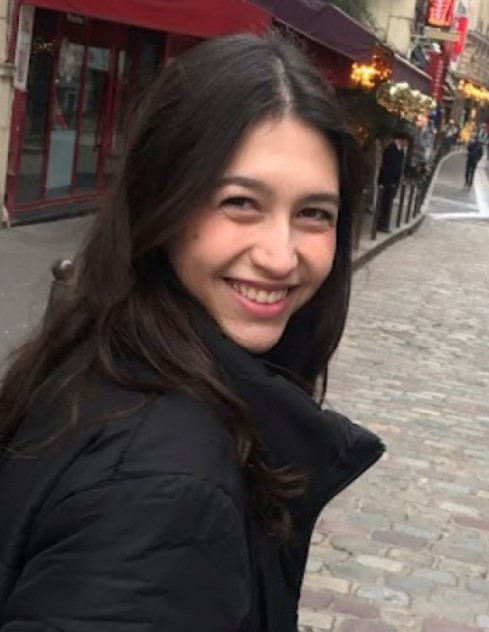

<section>
	<header class="major">
		<h2>Lab director</h2>
	</header>
	
	

		<article>
			
			<h3>Roberto (Director)</h3>
			
Dr. Roberto Cofresí is an Assistant Research Professor at the University of Missouri - Columbia. His undergraduate and graduate training in Biochemistry and Neuroscience, respectively, were completed at the University of Texas - Austin. Roberto is interested in  bidirectional translation between rodent and human neuroscience laboratories studying addiction-related learning and memory. The goal of his research is to understand why and how naturally learned signals (cues) for drugs of abuse like alcohol are able to capture attention, impel approach, and promote over-consumption in some of us but not others. Contact at: cofresir at missouri.edu

		</article>
		

</section>
		
		
		
		
<section>
	<header class="major">
		<h2>Sips & Shapes Study Research Staff </h2>
	</header>
	

		<article>
			
			<h3>Alana (Research Coordinator)</h3>
			
Ms. Alana Hatanaka is an undergraduate student majoring in Health Sciences with an interest in pursuing graduate training in health administration. Alana has been working with Dr. Cofresi since Spring 2023 to learn more about program coordination and the neuroscience of addiction. She already has experience collecting and analyzing EEG data, so she is now focused on learning how to collect and analyze functional MRI data from human participants.

		</article>
		
			<article>
			
			<h3>Abigail (Undergraduate Research Assistant)</h3>
			
Ms. Elizabeth Abigail Obregon is an undergraduate student majoring in Nutrition and Exercise Physiology with an interest in pursuing graduate training in medicine. Abigail joined the lab in Fall 2022 to learn more about the process of scientific research. She is learning how to collect and analyze EEG data from human participants.

		</article>
		
		<article>
			
			<h3>Darius (Undergraduate Research Assistant)</h3>
			
Mr. Darius Stewart is an undergraduate student majoring in Public Health with an interest in pursuing graduate training in public health and social work. Darius joined the lab in Fall 2022 to learn more about the neuroscience of addiction. He is learning how to collect and analyze EEG data from human participants.

		</article>
		

</section>

