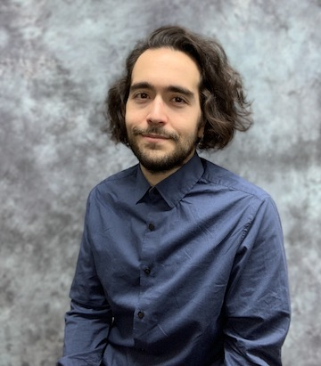

Dr. Cofresí earned a B.Sc. in biochemistry and a Ph.D. in neuroscience from the University of Texas at Austin. He is interested in adapting promising anti-addiction and anti-relapse interventions identified in preclinical rodent models for use on human subjects and testing those adapted interventions in the preclinical human laboratory.

			