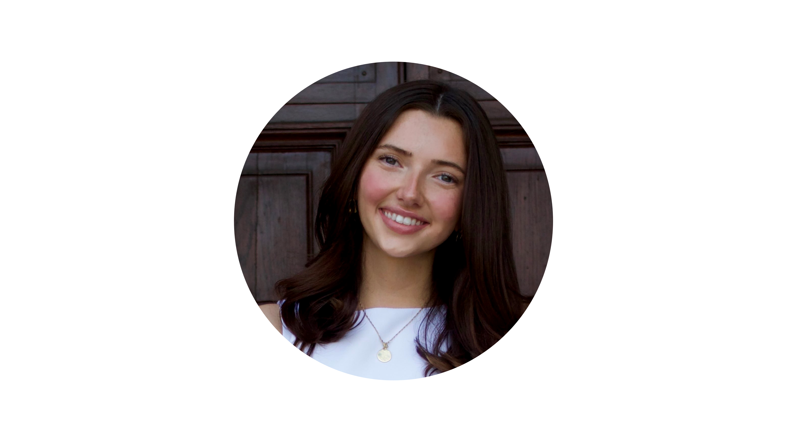
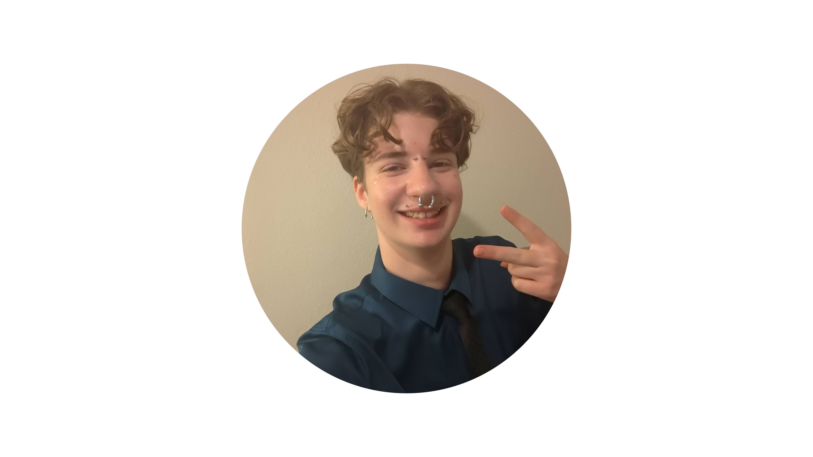

<section>

	<header class="major">
		<h2>Lab direction</h2>
	</header>
	
	

		
<article>

			
			<h3><a href="https://psychology.missouri.edu/people/cofresi-bonilla" target="_blank" rel="noopener noreferrer">Dr. Roberto Cofresí</a></h3> 
			<b>Principal Investigator, Assistant Professor</b> | <em>he/him</em> 
			Department of Psychological Sciences, University of Missouri 
			<em>
			<i class="fa fa-university" aria-hidden="true"></i>PhD Neuroscience, University of Texas at Austin  
			<i class="fa fa-university" aria-hidden="true"></i>B.S Biochemistry, University of Texas at Austin  
			</em>
		  
		  Contact at: CofresiR at missouri.edu
		  <li><a href="https://orcid.org/0000-0003-1131-6142" target="_blank" rel="noopener noreferrer">ORCID iD</a></li>
		  <li><a href="https://scholar.google.com/citations?user=nRAErPEAAAAJ&hl=en" target="_blank" rel="noopener noreferrer">Google Scholar</a></li>
		  <li><a href="https://www.ncbi.nlm.nih.gov/myncbi/roberto.cofresi.1/bibliography/public/" target="_blank" rel="noopener noreferrer">NCBI</a></li>
		 

</article>

<article>
			
			<h3><a href="https://psychology.missouri.edu/people/keerstock-0" target="_blank" rel="noopener noreferrer">Dr. Sandie Keerstock</a></h3> 
			<b>Research Specialist Lead</b> | <em>she/her</em> 
			Department of Psychological Sciences, University of Missouri  
			
			<em>
			<i class="fa fa-university" aria-hidden="true"></i>PhD Linguistics, University of Texas at Austin, USA 
			<i class="fa fa-university" aria-hidden="true"></i>M.A. Phonetics & Phonology, Sorbonne Nouvelle, Paris France 
			<i class="fa fa-university" aria-hidden="true"></i>M.A. Language Sciences, Stendhal Univ., Grenoble France 
			<i class="fa fa-university" aria-hidden="true"></i>B.A. English Studies, UPPA, Pau France 
			</em>
			
			Contact at: SKeerstock at missouri.edu
			<li><a href="https://orcid.org/0000-0001-5121-594X" target="_blank" rel="noopener noreferrer">ORCID iD</a></li>
		  <li><a href="https://scholar.google.com/citations?user=NujhYIEAAAAJ&hl=en" target="_blank" rel="noopener noreferrer">Google Scholar</a></li>
		  <li><a href="https://www.ncbi.nlm.nih.gov/myncbi/sandie.keerstock.1/bibliography/public/ " target="_blank" rel="noopener noreferrer">NCBI</a></li>

</article>

</section>
		
		
		

		
		
<section>
	<header class="major">
		<h2>Graduate students</h2>
	</header>
	

	
	<article>
			
			<h3>Julián Aponte Zabala, B.A.</h3>
			<b>Graduate student</b>| <em>he/him</em> 
      Department of Psychological Sciences, University of Missouri  
			
			<em>
			<i class="fa fa-university" aria-hidden="true"></i>B.A. Psychology, University of Puerto Rico, Rio Piedras 
			</em>
			
			Contact at: jaqth at missouri dot edu
			<!-- <li><a href="" target="_blank" rel="noopener noreferrer">ORCID iD</a></li>
-->

</article>
	
	

</section>

		
		
		
		

		
		
<section>
	<header class="major">
		<h2>Full-time research coordinator</h2>
	</header>
	

	

<article>
			
			<h3>Kayla Drifka, B.S.</h3>
			<b>Research Coordinator</b>| <em>she/her</em> 
      Department of Psychological Sciences, University of Missouri  
			
			<em>
			<i class="fa fa-university" aria-hidden="true"></i>B.S. for Biopsychology, Cognition, & Neuroscience (minor in Quantitative Methods in the Social Sciences), University of Michigan 
			</em>
			
			Contact at: kd92d at missouri dot edu

</article>

</section>

		
		
		
<section>
	<header class="major">
		<h2>Postbac research staff</h2>
	</header>
	

   <article>
			
			<h3>Mason Chartrand, B.A.</h3>
			<b>Research Technician</b> | <em>he/him</em> 
			<em><i class="fa fa-university" aria-hidden="true"></i>B.A. in Psychology, University of Missouri</em> 
			<em><i class="fa fa-university" aria-hidden="true"></i>B.A. in Sociology, University of Missouri</em> 
			<i class="fa fa-calendar" aria-hidden="true"></i> Joined the lab: Spring 2025
		</article>
		

</section>

		
		
		
<section>
	<header class="major">
		<h2>Undergraduate research staff</h2>
	</header>
	

	
		<article>
			
			<h3>Camila Gutierrez</h3>
			<b>Undergraduate Research Assistant</b> | <em>she/her</em> 
			Double majoring in Psychology and Biology with emphasis in Human Biology and Medical Science.  
			<i class="fa fa-calendar" aria-hidden="true"></i> Joined the lab: Summer 2023
		</article>
	
  
		 <article>
			
			<h3>Lukas Hawkins</h3>
			<b>Undergraduate Research Assistant</b> | <em>he/him</em> 
			
Double majoring in Chemistry and Physics 
			<i class="fa fa-calendar" aria-hidden="true"></i> Joined the lab: Fall 2023

		</article>
			
			
		
		<article>
			
			<h3>River Stone</h3>
			<b>Undergraduate Research Assistant</b> | <em>he/him</em> 
			
Majoring in Psychology 
			<i class="fa fa-calendar" aria-hidden="true"></i> Joined the lab: Summer 2025

		</article>
		
		<article>
			
			<h3>Noah Schnarre</h3>
			<b>Undergraduate Research Assistant</b> | <em>he/him</em> 
			
Majoring in Psychology, Pre-Med track 
			<i class="fa fa-calendar" aria-hidden="true"></i> Joined the lab: Summer 2025

		</article>
		
		
		<article>
			
			<h3>Makayla Guilbert</h3>
			<b>Undergraduate Research Assistant</b> | <em>she/her</em> 
			
Majoring in Health Sciences, emphasis in Rehabilitation 
			<i class="fa fa-calendar" aria-hidden="true"></i> Joined the lab: Fall 2025

		</article>
		

</section>

		
<section>
	<header class="major">
		<h2>Lab Alumni </h2>
	</header>
	
	<ul>
	
<li><b>Devon Terry</b>. September 2024 to August 2025. Then: Research Coordinator. Now: Graduate Student in Clinical Psychology at University at Buffalo.</li>
	
<li><b>Lainie Mueller</b>. Summer 2025. Then: MU-ARTSS Intern.</li>

<li><b>Darius Stewart</b>. Fall 2022 to Spring 2025. Then: Research Assistant/Technician.</li>

			<li><b>Elizabeth Conley</b>. Fall 2021 to Spring 2024. Then: Undergraduate Research Assistant. Last known: PhD student in Neuroscience, Washington University in St. Louis. </li>
		
		
		  <li><b>Peyton Maras</b>. Fall 2023 to Spring 2024.Then: Undergraduate Research Assistant.</li>
		
			
			<li><b>Katelyn Matzdorf</b>.	Spring 2023 to Spring 2024.	Then: Undergraduate Research Assistant.</li>
			
		
			<li><b>Abigail Obregon</b>.	Fall 2022 to Spring 2024. Then: Undergraduate Research Assistant. </li>
			
		
			<li><b>Paola Gonzalez</b>. Fall 2023.Then: Undergraduate Research Assistant. Last known: Master's student, MU Social Work.</li>
			
					
			<li><b>Sophia Slinkard</b>. Fall 2022 to Spring 2023. Then: Undergraduate Research Assistant. Last known: Medical student, KCU.</li>
			
			
			<li><b>Liam Peck</b>. Fall 2022 to Spring 2023.Then: Undergraduate Research Assistant. Last known: Research Specialist, MU Psychological Sciences.</li>
			
			
			<li><b>Ian Flowers</b>.	Fall 2022 to Spring 2023.Then: Undergraduate Research Assistant. Last known: Applied Psychology at Maastricht University, Netherlands.</li>
			
			
			<li><b>Jasmine Chen</b>.	Fall 2022 to Spring 2023.	Then: Undergraduate Research Assistant. MARC/IMSD Intern.</li>
			
			
			<li><b>Hannah Drzewiecki</b>. Fall 2022 to Spring 2023. Then: Undergraduate Research Assistant. MARC/IMSD Intern.</li>
			
			
			<li><b>Alana Hatanaka</b>.	Spring to Summer 2023.	Then: Research coordinator. Last known: Senior Clinical Lab Technician, MU Veterinary Diagnostic Laboratory.</li>
			
			
			<li><b>Rawan Ebada</b>.	Fall 2021 to Fall 2022.	Then: Undergraduate Research Assistant.</li>
			
			
			<li><b>Mikayla Rodgers</b>. Fall 2020 to Spring 2022. Then: Research coordinator, Undergraduate Research Assistant. Last known: Medical Student, Rocky Vista University</li>
			
</ul>

</section>

